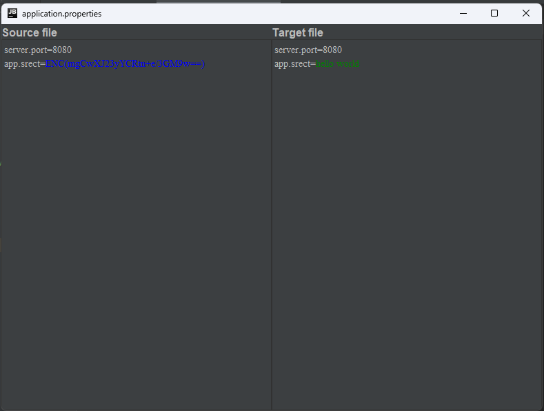

# Description

The ENC decryption tool, which can decrypt configuration files using <a href="https://github.com/ulisesbocchio/jasypt-spring-boot" >jasypt-spring-boot</a>, can be used for file verification when you use <a href="https://github.com/ulisesbocchio/jasypt-spring-boot">jasypt-spring-boot</a>  in your project

# Feature
1. Feature 1 - decrypt
   
2. Feature 2 - encrypt
   

# Attention!!!

As you have used, the current decryption method supports the ECB/PKCS5NoPadding method in AES. If you use other encryption methods or KMS, it is not supported yet. Hope you can contribute your code to this project!