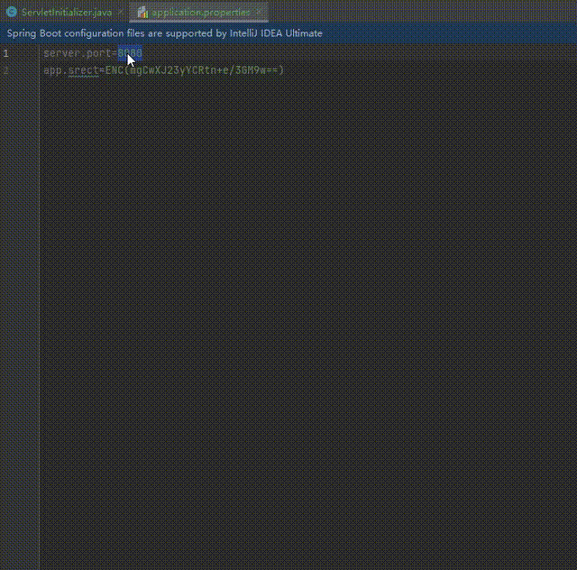

# Description

The ENC decryption tool, which can decrypt configuration files using <a href="https://github.com/ulisesbocchio/jasypt-spring-boot" >jasypt-spring-boot</a>, can be used for file verification when you use <a href="https://github.com/ulisesbocchio/jasypt-spring-boot">jasypt-spring-boot</a>  in your project

# Feature

1. Feature 1 - decrypt

   Supports comparison of selected files before and after encryption and decryption
   
2. Feature 2 - encrypt

   
   1. Support encryption of selected text
   2. Supports encryption of matching attributes in the entire configuration file through regular expressions

3. Feature 3 - more style comparison

   Supported algorithm:
   * AES/ECB/PKCS5Padding
   * AES/ECB/NoPadding
   * AES/CBC/PKCS5Padding
   * AES/CBC/NoPadding
   * DESede/ECB/PKCS5Padding
   * DESede/ECB/NoPadding
   * DESede/CBC/PKCS5Padding
   * DESede/CBC/NoPadding
   * PBEWithMD5AndDES
   * PBEWithSHA1AndDESede
   * PBEWithHmacSHA256AndAES_128
   * PBEWithHmacSHA512AndAES_256
